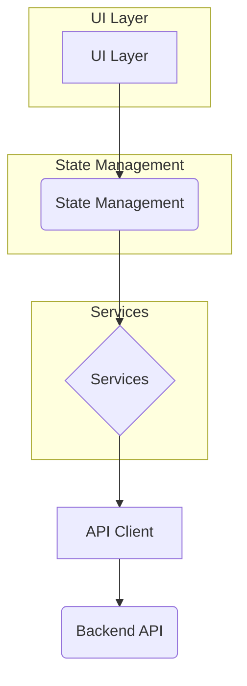

# Design: Flutter Uploader App

This document outlines the design for the Flutter Uploader App.

## 1. Overview

The Flutter Uploader App is a web-first application that enables employees to upload media files and associate them with specific users. The application will be built using Flutter and will be designed to be responsive and work seamlessly across different devices.

## 2. Architecture

The application will follow a layered architecture using the Provider pattern for state management.

-   **UI Layer:** Comprises the widgets and screens that the user interacts with.
-   **State Management:** Manages the application's state using `Provider`. This includes `AuthProvider` for authentication status and `AppProvider` for the general app state.
-   **Services:** Contains the business logic, such as authentication, user management, and file uploading.
-   **API Client:** Handles communication with the backend API.

## 3. Components and Interfaces

### 3.1. Screens

-   **LoginScreen:** A screen with a form for employees to log in.
-   **HomeScreen:** The main screen after login, which will contain the user selection and file upload components.

### 3.2. Widgets

-   **UserSearch:** A widget that allows employees to search for and select a user.
-   **ImagePicker:** A widget that allows employees to select images from their device or take a photo.
-   **UploadProgress:** A widget that displays the progress of file uploads.

## 4. Data Models

-   **Employee:** Represents an authenticated employee.
    -   `id`: String
    -   `username`: String
    -   `token`: String
-   **User:** Represents a target user.
    -   `id`: String
    -   `name`: String
-   **MediaFile:** Represents a file to be uploaded.
    -   `file`: File
    -   `status`: Enum (pending, uploading, completed, failed)

## 5. Error Handling

-   Errors will be handled at the service level and propagated to the UI layer.
-   The UI will display user-friendly error messages.
-   For file uploads, a retry mechanism will be implemented for failed uploads.

## 6. Testing Strategy

-   **Unit Tests:** For services and data models.
-   **Widget Tests:** For UI components.
-   **Integration Tests:** To test the complete workflow, from login to file upload.
