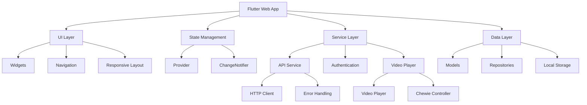

# Step 5: Build Flutter User App

## Overview
This step focuses on building a Flutter-based user application for the social media platform. The app will provide users with an interface to browse, view, and interact with plant growth content including reels and timelapse videos.

## Web-First Requirements
- **Primary Target**: Web browsers (Chrome, Firefox, Safari, Edge)
- **Native Mobile**: Android/iOS native builds are NOT required
- **Progressive Web App (PWA)**: Enable PWA features for web deployment
- **Browser Compatibility**: Ensure compatibility with modern web browsers

## Mobile Responsiveness Requirements
- **Mobile-First Design**: Design primarily for mobile screen viewports (320px-414px width)
- **Responsive Breakpoints**:
  - Mobile: 320px - 767px
  - Tablet: 768px - 1023px
  - Desktop: 1024px+
- **Touch-Friendly Interface**: All interactive elements must have minimum 44px touch targets
- **Viewport Optimization**: Use responsive units (media queries, flexible layouts)

## Prerequisites and Dependencies

### Flutter SDK Requirements
- Flutter SDK 3.0.0 or higher
- Dart SDK 2.19.0 or higher
- Chrome browser for web development
- Flutter web support enabled

### Core Dependencies
```yaml
dependencies:
  flutter:
    sdk: flutter
  cupertino_icons: ^1.0.2
  http: ^1.0.0                    # API communication
  video_player: ^2.6.0           # Video playback
  chewie: ^1.7.0                 # Video player UI
  provider: ^6.0.5               # State management
  shared_preferences: ^2.2.0     # Local storage
  intl: ^0.18.1                  # Internationalization
  url_launcher: ^6.1.12          # External links
  cached_network_image: ^3.2.3   # Image caching
  flutter_staggered_grid_view: ^0.6.2  # Grid layouts
```

### Development Dependencies
```yaml
dev_dependencies:
  flutter_test:
    sdk: flutter
  flutter_lints: ^2.0.0
  flutter_launcher_icons: ^0.13.1
  flutter_native_splash: ^2.3.1
```

## Comprehensive Implementation Checklist

### Phase 1: Project Setup and Configuration
- [ ] **Flutter Project Initialization**
  - Create new Flutter project with web support
  - Configure project structure following Flutter best practices
  - Set up proper directory structure for features, widgets, services
  - Configure build settings for web deployment

- [ ] **Web Configuration**
  - Enable Flutter web support
  - Configure PWA manifest for web app installation
  - Set up proper base href for web hosting
  - Configure service worker for offline capabilities

- [ ] **Dependency Management**
  - Add all required dependencies to pubspec.yaml
  - Configure version constraints appropriately
  - Set up dependency injection pattern
  - Configure build flavors for different environments

- [ ] **Development Environment**
  - Set up VS Code with Flutter extensions
  - Configure debugging for web targets
  - Set up hot reload configuration
  - Configure build and deployment scripts

### Phase 2: Core Architecture and State Management
- [ ] **App Architecture Setup**
  - Implement provider pattern for state management
  - Set up service layer for API communication
  - Configure routing with go_router for web-friendly URLs
  - Implement repository pattern for data management

- [ ] **API Service Configuration**
  - Create HTTP client with proper error handling
  - Implement authentication service
  - Set up API endpoints for reels, timelapse, user data
  - Configure request/response interceptors
  - Implement retry logic and timeout handling

- [ ] **Data Models**
  - Create Dart models for API responses
  - Implement JSON serialization/deserialization
  - Set up data validation and error handling
  - Configure offline data caching strategy

- [ ] **Navigation and Routing**
  - Implement web-friendly routing with go_router
  - Set up nested navigation for different app sections
  - Configure deep linking support
  - Implement browser back/forward button support

### Phase 3: User Interface Components
- [ ] **Base UI Components**
  - Create responsive scaffold with mobile-first design
  - Implement touch-friendly button components (44px minimum)
  - Set up consistent typography and color scheme
  - Create loading indicators and error states

- [ ] **Navigation Components**
  - Implement bottom navigation for mobile (5 tabs max)
  - Create responsive navigation drawer for larger screens
  - Set up app bar with search functionality
  - Implement breadcrumb navigation for web

- [ ] **Video Player Components**
  - Implement custom video player using chewie
  - Add video controls optimized for touch
  - Implement fullscreen video playback
  - Add video buffering and error handling
  - Configure video quality selection

- [ ] **Grid and List Components**
  - Create responsive grid layouts for content browsing
  - Implement infinite scroll for content loading
  - Add pull-to-refresh functionality
  - Set up content filtering and sorting

### Phase 4: Core Features Implementation
- [ ] **Authentication Flow**
  - Implement login/register screens
  - Set up token-based authentication
  - Configure protected routes
  - Implement logout functionality
  - Add remember me functionality

- [ ] **Reels View**
  - Create vertical scrolling reels interface
  - Implement video autoplay on scroll
  - Add like, comment, share functionality
  - Set up user interaction tracking
  - Implement video progress indicators

- [ ] **Timelapse View**
  - Create timelapse video gallery
  - Implement filtering by plant type, duration
  - Add timelapse comparison features
  - Set up playlist functionality
  - Implement download functionality

- [ ] **User Profile Pages**
  - Create user profile view with avatar and bio
  - Implement user's uploaded content grid
  - Add profile editing functionality
  - Set up follower/following system
  - Implement user statistics display

- [ ] **Browsing Functionality**
  - Implement content discovery page
  - Add search functionality with filters
  - Create category-based browsing
  - Implement trending/popular content sections
  - Add content recommendation system

### Phase 5: Responsive Design and Mobile Optimization
- [ ] **Mobile-First Layouts**
  - Implement responsive breakpoints using MediaQuery
  - Create flexible layouts using Expanded and Flexible widgets
  - Set up proper aspect ratios for video content
  - Configure touch target sizes (minimum 44px)

- [ ] **Touch Interactions**
  - Implement swipe gestures for navigation
  - Add pinch-to-zoom for images
  - Configure tap delays and feedback
  - Set up long-press context menus

- [ ] **Performance Optimization**
  - Implement lazy loading for images and videos
  - Set up image caching with cached_network_image
  - Optimize video loading and buffering
  - Configure proper memory management

- [ ] **Accessibility Features**
  - Add proper semantic markup
  - Implement keyboard navigation
  - Configure screen reader support
  - Add focus indicators for web

### Phase 6: Testing and Quality Assurance
- [ ] **Unit Testing**
  - Write unit tests for data models
  - Test API service methods
  - Implement widget testing for UI components
  - Set up test coverage reporting

- [ ] **Integration Testing**
  - Test complete user flows
  - Verify API integration
  - Test navigation and routing
  - Validate responsive behavior

- [ ] **Performance Testing**
  - Test app performance on different devices
  - Verify video playback performance
  - Check memory usage and battery consumption
  - Validate loading times and responsiveness

- [ ] **Cross-Browser Testing**
  - Test on Chrome, Firefox, Safari, Edge
  - Verify PWA functionality
  - Check responsive behavior across screen sizes
  - Validate touch interactions

### Phase 7: Deployment and Production
- [ ] **Build Configuration**
  - Configure production build settings
  - Set up code obfuscation and minification
  - Configure environment-specific variables
  - Set up proper asset optimization

- [ ] **Web Deployment**
  - Build Flutter web app for production
  - Configure hosting settings (Firebase, Netlify, etc.)
  - Set up CDN for static assets
  - Configure SSL and security headers

- [ ] **Monitoring and Analytics**
  - Set up error tracking and monitoring
  - Implement user analytics
  - Configure performance monitoring
  - Set up crash reporting

- [ ] **Documentation**
  - Create user documentation
  - Document API integration
  - Set up developer guides
  - Create deployment documentation

## Expected Outcomes and Verification Steps

### Functional Requirements Verification
- [ ] App loads successfully in web browsers
- [ ] Users can register and login
- [ ] Reels play automatically on scroll
- [ ] Timelapse videos load and play properly
- [ ] User profiles display correctly
- [ ] Search and filtering work as expected
- [ ] All interactive elements are touch-friendly

### Performance Requirements Verification
- [ ] Initial load time under 3 seconds
- [ ] Video playback is smooth without buffering
- [ ] Scrolling is smooth on mobile devices
- [ ] Memory usage stays within acceptable limits
- [ ] App works offline with cached content

### Responsive Design Verification
- [ ] UI adapts properly to different screen sizes
- [ ] Touch targets are at least 44px on mobile
- [ ] Content is readable on all screen sizes
- [ ] Navigation works on both mobile and desktop
- [ ] Video player adapts to screen orientation

### Browser Compatibility Verification
- [ ] App works on Chrome, Firefox, Safari, Edge
- [ ] PWA features work (install, offline mode)
- [ ] All functionality works across browsers
- [ ] Performance is consistent across browsers

## Architecture Overview



## Key Implementation Considerations

### Web-Specific Optimizations
- Use `flutter build web --release` for production builds
- Configure proper meta tags for SEO
- Implement proper URL routing for web
- Optimize bundle size for faster loading

### Mobile-First Design Principles
- Start with mobile layouts (320px width)
- Use flexible units (percentages, flex layouts)
- Implement touch-friendly interactions
- Optimize for thumb navigation

### Performance Best Practices
- Implement lazy loading for content
- Use image optimization and caching
- Minimize rebuilds with proper key usage
- Implement proper state management to avoid unnecessary renders

## Resources and Documentation

### Official Flutter Documentation
- [Flutter Web Documentation](https://docs.flutter.dev/development/platform-integration/web)
- [Flutter Responsive Design](https://docs.flutter.dev/development/ui/layout/responsive)
- [Flutter Video Player](https://pub.dev/packages/video_player)
- [Flutter PWA Guide](https://docs.flutter.dev/development/platform-integration/web/web-renderers)

### Recommended Packages
- [go_router](https://pub.dev/packages/go_router) - Web-friendly routing
- [provider](https://pub.dev/packages/provider) - State management
- [chewie](https://pub.dev/packages/chewie) - Video player UI
- [cached_network_image](https://pub.dev/packages/cached_network_image) - Image caching

### Development Tools
- [Flutter DevTools](https://docs.flutter.dev/tools/devtools) - Debugging and profiling
- [Flutter Inspector](https://docs.flutter.dev/tools/devtools/inspector) - UI debugging
- [Browser DevTools](https://developers.google.com/web/tools/chrome-devtools) - Web debugging

### Best Practices
- [Flutter Performance Best Practices](https://docs.flutter.dev/perf)
- [Material Design Guidelines](https://material.io/design)
- [Web Accessibility Guidelines](https://www.w3.org/WAI/WCAG21/quickref/)
- [Mobile-First Design Principles](https://www.lukew.com/ff/entry.asp?933)

## Next Steps
After completing this step file:
1. Review the checklist and make any necessary adjustments
2. Switch to Code mode to begin implementation
3. Follow the checklist items in order
4. Update progress and address any blockers
5. Test thoroughly across different browsers and devices

## Risk Mitigation
- **Browser Compatibility**: Test on multiple browsers during development
- **Performance Issues**: Monitor performance metrics throughout development
- **Mobile Responsiveness**: Test on actual mobile devices, not just browser dev tools
- **API Integration**: Implement proper error handling and offline support
- **Touch Interactions**: Test all touch interactions on actual mobile devices

## Success Criteria
- App loads and functions properly in all target browsers
- All core features (reels, timelapse, profiles, browsing) work as expected
- UI is fully responsive and mobile-optimized
- Performance meets the defined benchmarks
- Code is well-structured, documented, and maintainable